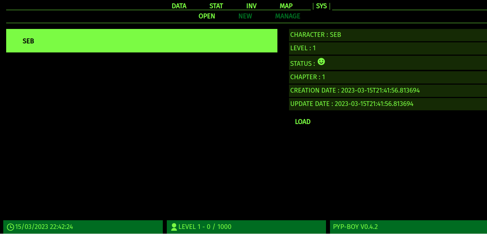

# Pyp-Boy

Pyp-boy is a Python Flask-based text role playing game inspired by the *Fallout* lore. At the beginning of this project, the idea was to make a quick and dirty attempt to create a pip-boy for the Pinephone, but the more the development advanced, the more I've shifted to this idea.



## Warning

This game is still under development. The story is currently available in French.

The first chapter of the story is complete.

## Install

### Using a container (Docker, Podman..)

Pull the image (adapt the version number with the latest release).

```bash
podman pull ghcr.io/wivik/pyp-boy:v0.4.2
```

Run the container, using a volume for the /pypboy/data directory inside the container (because it stores your save file).

```bash
podman run --rm -v <somepath>:/pypboy/data -p 5000:5000 ghcr.io/wivik/pyp-boy:v0.4.2
```

Open your browser to http://localhost:5000 and enjoy.

### Using source code

Clone the repository.

Install requirements :

```bash
pip install --user requirements.txt
```

Run flask

```bash
python -m flask run
```

Open your browser to http://localhost:5000

## How to play

The first thing the web application will do is downloading the game's database available in [GitHub's release](https://github.com/Wivik/pyp-boy/releases).  The database simply contains the story and it's branches and various items definitions. If the a new version is available, the game will prompt for an update. The databse is stored in `./data`. If the DB has been deleted by mistake, you may just need to  the homepage http://localhost:5000 and it will download it again.

You'll prompted to create a save file. The game saves its data in `./data/save.db` using an sqlite3 database.

Following that, you'll be asked to create your character's name. Then, select the character and click on "Load".

The menus are :

- DATA : The game's story to follow and the complete recap or your selected path.
- STAT : Not implemented
- INV : The items you've collected through the story
- MAP : The Map tab using OSM integration, currently broken since the changes made to integrate it in the story. This tab is currently useless.
- SYS : The save file management

During the story, you'll be prompted to choose some actions. They can trigger variations in the story, and even a game over. Once the character is dead, the story cannot be continued and a new character has to be created or the save file deleted (no menu yet for this, you need to open the sqlite db and delete the lines in table).

Your character will earn EXP and increase its level. There is currently no incidence with that.

### Roadmap

- Translate the story in English, multilingual support may be useful.
- The story does not takes account in the character's selected gender yet, it would be nice to implement it later.
- The MAP tab is intended to display the various discovered locations using OSM as a background. It will try to create a fictional map using actual ones.
- Continue the story.
- Add a better management for the data save, possibility to delete one entry.
- The STAT tab could display character's informations and maybe introducing the *Fallout*'s icon SPECIAL system, only for cosmetic purpose since there is no actual gameplay.

## Contribute

This project is mainly a playground for coding learning for a not-developer guy. But any contributions are welcome anyway.

## Attribution

Unless other statement, this project is licensed under MIT.

Maps based on [OpenStreetMap](https://www.openstreetmap.org/), using [Leaflet](https://leafletjs.com) and [Stamenmaps](http://maps.stamen.com/#watercolor/12/37.7706/-122.3782) render.

Icons are from [Remix Icon](https://remixicon.com).

The game's illustrations has been generated with [Craiyon](https://www.craiyon.com).
